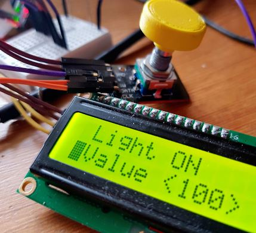
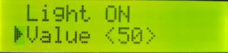

# fxLcdMenu

**Customizable menu library for LC Displays**


## Purpose



## Simple Example

```c++
#include <LiquidCrystal_I2C.h>
#include <fxMenu.h>

LiquidCrystal_I2C lcd;

fxMenuNav* nav = new fxMenuNav();
fxMenuList* mainmenu = new fxMenuList();
fxMenuItem first("First");

void setup() {
  lcd.begin();
  mainmenu->add(&first);
  nav->setMenu(mainmenu);
}
```


## Features

- programmatic menu navigation
- ideal for use with rotary controllers
- horizontal scroll transition effects
- Item type: text, toggle, inplace value edit, submenu, back


## Screenshots




## Dependencies

This library depends on the following libraries:

- LiquidCrystal_I2C https://github.com/johnrickman/LiquidCrystal_I2C


## History

### 0.2.0
  - new header file structure

### 0.1.0
  - initial github commit
